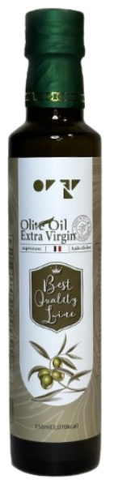

# AVO FnC의 작업물 Display를 위한 웹페이지

## 🛠 기능

1. Box 선택
2. Box에 맞는 물품을 선택
3. 발주처, 보내는 이 입력

## 라이센스

## 📦 Box

<table style="table-layout:fixed;width:100%;" border=2px>
    <tr>
        <td align="center"><b>블랙스완</b></td>
        <td align="center"><b>마리카</b></td>
    </tr>
    <tr>
        <td align="center"></td>
        <td align="center"></td>
    </tr>
</table>

## 🍾 물품

<table style="table-layout:fixed;width:100%;" border=2px>
    <tr>
        <td align="center"><b>아보카도 엑스트라버진</b></td>
        <td align="center"><b>올리브 엑스트라버진</b></td>
        <td align="center"><b>올리브 포마스</b></td>
        <td align="center"><b>참기름</b></td>
    </tr>
    <tr>
        <td align="center">
        
        </td>
        <td align="center">
        
        </td>
        <td align="center">
        
        </td>
        <td align="center">
        
        </td>
    </tr>
    <tr>
        <td align="center"><b>트러플 오일</b></td>
        <td align="center"><b>발사믹 식초</b></td>
        <td align="center"><b>해바라기 오일</b></td>
        <td align="center"><b>핑크 솔트</b></td>
    </tr>
    <tr>
        <td align="center">
        
        </td>
        <td align="center">
        
        </td>
        <td align="center">
        
        </td>
        <td align="center">
        
        </td>
    </tr>
</table>